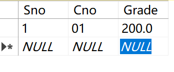

# 实验7：数据约束

# 实验操作

```sql
Create database SchoolManagement	--建SchoolManagement数据库
go
```

```sql
use SchoolManagement
create table S
(	Sno nvarchar(10) not null,
	Sname nvarchar(10) unique,	--(1)建立唯一性约束
	Ssex nchar(1),
	Sage smallint,
	Sdept nvarchar(50),
	Scholarship money,
	primary key(Sno),	--(1)a
);
```

```sql
alter table S drop constraint UQ__S__52723D2775DD36B8;	--b、取消Sname的唯一性约束
alter table S add constraint Sname unique(Sname)	;	--c、增加Sname的唯一性约束
```

```sql
create table C	--	d、创建C表
(	Cno nvarchar(10) not null,
	Cname nvarchar(15) ,
	Ccredit decimal(4,1) check(15>=Ccredit and Ccredit>=0),	--为学分Ccredit创建CHECK约束
	Pno nvarchar(10),
	primary key(Cno),
);
```

```sql
alter table C nocheck constraint CK__C__Ccredit__2A4B4B5E --停用CHECK约束
alter table C check constraint CK__C__Ccredit__2A4B4B5E --启用CHECK约束
```

```sql
create table SC --创建表SC，同时是设置主键和外键，对Grade设置default约束
(	Sno nvarchar(10) not null,
	Cno nvarchar(10) not null,
	Grade numeric(5,1) default 60,
	primary key(Sno,Cno),
	foreign key (Sno) references S(Sno),
	foreign key (Cno) references C(Cno),
)
```

```sql
alter table SC drop constraint DF__SC__Grade__2D27B809--取消default约束
alter table SC add constraint Grade default(0) for Grade --添加default约束，使默认值为0
```

```sql
create rule Grade_Rule as @Grade between 0 and 100;--创建规则
go
create rule Ssex_Rule as @Ssex in ('M','F');
go
create rule Sno_Rule as @Sno like '[a-z][a-z][-][0-9][0-9][0-9][0-9][0-9][0-9][0-9]%' and (len(@Sno)=10);--一共十位，前两位为数字，中间是-，后七位都是0-9的数字
```

```sql
exec sp_bindrule 'Grade_Rule','SC.Grade';--绑定规则
exec sp_bindrule 'Ssex_Rule','S.Ssex';
exec sp_bindrule 'Sno_Rule','S.Sno';
exec sp_bindrule 'Sno_Rule','C.Cno';
```

经过验证，插入的规则会和约束一起生效

```sql
exec sp_unbindrule 'SC.Grade'--解绑规则
```



解绑生效，成绩可超过100

```sql
drop rule Grade_Rule;  --删除规则
```

```sql
create default Sage_Default as 0;--设置default
go
create default Ssex_Defalut_1 as 'M';
go
create default Ssex_Default_2 as '男';

```

```sql
exec sp_bindefault 'Sage_Default','S.Sage';--绑定默认值
exec sp_bindefault 'Ssex_Defalut_1','S.Ssex';
exec sp_unbindefault 'S.Ssex'--删除default绑定
exec sp_bindefault 'Ssex_Default_2','S.Ssex'--绑定第二个性别默认规则
```

如果定义时就已经定义了约束，默认值会更改


