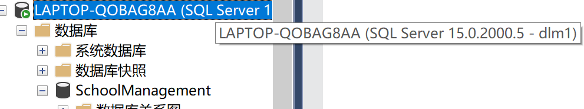
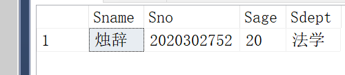

# 实验9-安全访问授权

# 前期准备

```sql
--建立数据库
create database SchoolManagement
use SchoolManagement
--建立三个关系表
create table S
(	Sno nvarchar(10) not null,
	Sname nvarchar(10) not null,	
	Ssex nchar(1) not null,
	Sage smallint not null,
	Sdept nvarchar(50) not null,
	BirthPlace nvarchar(10),
	primary key(Sno),
);
go
create table C	
(	Cno nvarchar(10) not null,
	Cname nvarchar(15) not null,
	Ccredit smallint not null,	
	Cpno nvarchar(10),
	primary key(Cno),
);
go
create table SC 
(	Sno nvarchar(10) not null,
	Cno nvarchar(10) not null,
	Grade numeric(5,2) not null,
	primary key(Sno,Cno),
	foreign key (Sno) references S(Sno),
	foreign key (Cno) references C(Cno),
);
--插入数据
insert into S
values('2020302751','万叶','F','20','乐','原神'),
('2020302752','烛辞','F','20','法学','蚌埠'),
('2020302753','知一','M','20','SC','伊甸园'),
('2020302754','诗音','F','18','CS','伊甸园'),
('2020302755','瑞吉','F','20','SC','英国'),
('2020302756','零迪','M','19','SC','日本'),
('2020302757','凯子哥','M','20','SC','宝鸡'),
('2020302758','女武神','F','20','PHOTO','彩六'),
('2020302759','女鬼','F','20','刺客','巴西'),
('2020302760','索菲亚','F','21','RU','澳大利亚'),
('2020302761','筱','M','19','艺术','元神'),
('2020302762','王晟睿','M','20','软件','山东'),
('2020302763','刘傲然','M','19','软件','山东'),
('2020302764','李达','M','21','CS','西藏')
--插入数据
insert into C
values('01','数据库原理','2','5'),
('02','摄影艺术','1','6'),
('03','轮回','3','5'),
('04','间谍潜入','2','4'),
('05','葡萄酒鉴赏','2','8'),
('06','VLOG教学','1','9')
--SC表插入数据
insert into SC
values('2020302751','01','80'),
('2020302751','02','80'),
('2020302751','03','80'),
('2020302751','04','80'),
('2020302751','05','80'),
('2020302751','06','80'),
('2020302752','01','80'),
('2020302752','02','80'),
('2020302752','03','80'),
('2020302752','04','80'),
('2020302752','05','80'),
('2020302752','06','80'),
('2020302753','01','80'),
('2020302753','02','80'),
('2020302753','03','80'),
('2020302753','04','80'),
('2020302753','05','80'),
('2020302753','06','80'),
('2020302754','01','80'),
('2020302754','02','80'),
('2020302754','03','80'),
('2020302754','04','80'),
('2020302754','05','80'),
('2020302754','06','80'),
('2020302755','01','80'),
('2020302755','02','80'),
('2020302755','03','80'),
('2020302755','04','80'),
('2020302755','05','80'),
('2020302755','06','80'),
('2020302756','03','80'),
('2020302757','02','80'),
('2020302758','04','80'),
('2020302759','06','80'),
('2020302760','05','80')
```

# 实验内容

```sql
--创建登录名并赋予角色
create login dlm1 with password='1'
go
create login dlm2 with password='1'
go
create login dlm3 with password='1'
go
create login dlm4 with password='1'
go
create login dlm5 with password='1'
go
exec sp_addsrvrolemember 'dlm1' ,'public';
go
exec sp_addsrvrolemember 'dlm2' ,'public';
go
exec sp_addsrvrolemember 'dlm3' ,'public';
go
exec sp_addsrvrolemember 'dlm4' ,'public';
go
exec sp_addsrvrolemember 'dlm5' ,'public';
--创建数据库用户U1-U5,同时关联到登录名
exec sp_adduser 'dlm1','U1';
go
exec sp_adduser 'dlm2','U2';
go
exec sp_adduser 'dlm3','U3';
go
exec sp_adduser 'dlm4','U4';
go
exec sp_adduser 'dlm5','U5';
go
--授权、回收权限
--把S表查询权限给U1
grant select 
on S to U1;
go
--把S和C表全部授权给用户U2和U3
grant all on S to U2,U3;
go
grant all on C to U2,U3;
go
--把SC表查询权限给所有用户
grant select on SC to public;
go
--把S表和修改学生姓名权限给U4
grant select on S to U4;
go
grant update(Sno) on S to U4;
go
--把SC表插入权限给U5，允许其给予其他用户
grant insert on SC to U5
with grant option;
go
--把用户U4修改学号权限收回
revoke update(Sno) on S from U4;
go
--收回所有用户对SC表的查询权限
revoke select on SC from public;
go
--把用户U5对SC表的insert权限回收
revoke insert on SC from U5 cascade;

使用用户名U1登录数据库

--权限验证
use SchoolManagement
select Sname,Sno,Sage,Sdept from S
where Sname='烛辞'

```



登录名dlm1登录成功



U1用户对S表的查询权限授予成功